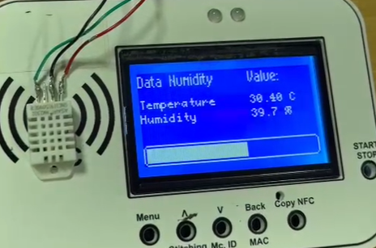
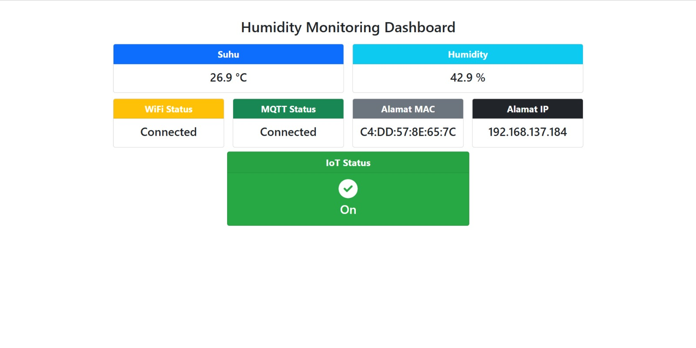

# Implementasi Sensor DHT22 dengan ESP32

Proyek ini mengimplementasikan sensor **DHT22** dengan **ESP32** untuk membaca suhu dan kelembapan udara. Data yang dibaca akan ditampilkan pada layar LCD dan dapat dipantau melalui web server dengan framework Flask.

## Deskripsi Proyek

Proyek ini bertujuan untuk mengukur suhu dan kelembapan udara menggunakan sensor DHT22 yang terhubung ke ESP32. Data yang diukur akan ditampilkan di layar LCD serta dikirim ke server web untuk dipantau.

### Fitur
- Pengukuran suhu dan kelembapan secara real-time.
- Tampilan data pada layar LCD 128x64.
- Web server untuk memantau data suhu dan kelembapan.

## Hardware yang Digunakan

- **ESP32**: Mikrokontroler untuk menjalankan program dan menghubungkan dengan sensor.
- **DHT22**: Sensor untuk mengukur suhu dan kelembapan udara.
- **LCD 128x64**: Layar untuk menampilkan hasil pembacaan data.
- **LED RGB**: Untuk indikator status.

## Instalasi

1. **Download dan Setup Arduino IDE**:
   - Pastikan Anda sudah menginstall [ardruino]([https://platformio.org/](https://support.arduino.cc/hc/en-us/articles/360019833020-Download-and-install-Arduino-IDE)).
   - Buka project ini menggunakan Arduino IDE.

2. **Install Library yang Dibutuhkan**:
   - Install library untuk DHT22 dan LCD sesuai dengan kebutuhan proyek ini.
  
3. **Buat Cloud Hivemq**:
   - Buat Cloud Hivemq.
     
4. **Install python dan flask**
   - ([https://platformio.org/]([https://support.arduino.cc/hc/en-us/articles/360019833020-Download-and-install-Arduino-IDE](https://flask.palletsprojects.com/en/stable/installation/ ))). 

## Cara Menjalankan Proyek

1. **Hubungkan sensor DHT22 dan ESP32 sesuai dengan pin yang telah ditentukan**.
2. **Upload kode program** ke ESP32 menggunakan Arduino IDE.
3. **Monitor data yang dibaca pada LCD** dan akses server web untuk melihat data lebih lanjut.
4. **Untuk menampilkan display web** install flask pada komputer pastikan python sudah terpasang.

## Menampilkan Gambar

### Gambar 1: Hasil ESP32 dan DHT22

## Kontribusi

Jika Anda tertarik untuk berkontribusi, silakan fork repository ini dan buat pull request dengan perbaikan atau fitur tambahan. Kami sangat menghargai kontribusi dari komunitas!

